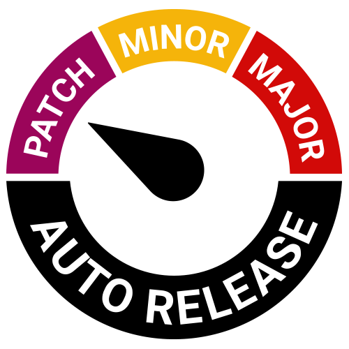

<div align="center">
  
  <h1>auto</h1>
  <p>Generate releases based on semantic version labels on pull requests</p>
</div>

<div align="center"><a href="https://circleci.com/gh/intuit/auto"></a> <a href="https://codecov.io/gh/intuit/auto"></a> <a href="https://www.npmjs.com/package/auto"></a> <a href="#contributors"></a> <a href="https://www.npmjs.com/package/auto"></a> <a href="https://github.com/intuit/auto"></a> <a href="https://app.snyk.io/org/hipstersmoothie/project/f32a03c3-9884-4fc9-9ac5-525c48799d4c"></a> <a href="https://app.fossa.io/projects/git%2Bgithub.com%2Fintuit%2Fauto?ref=badge_shield" alt="FOSSA Status"></a>
<a href="https://github.com/prettier/prettier"></a></div>

<br />

Automated releases powered by pull request labels. Streamline your release workflow and publish constantly! `auto` is meant to be run in a continuous integration (CI) environment, but all the commands work locally as well.

Release Features:

- Calculate semantic version bumps from PRs
- Skip a release with the `skip-release` label
- Publish canary releases from PRs or locally
- Generate changelogs with fancy headers, authors, and monorepo package association
- Use labels to create new changelog sections
- Generate a GitHub release

Pull Request Interaction Features:

- Get the labels for a PR
- Set the status of a PR
- Check that a pull request has a SemVer label
- Comment on a PR with markdown
- Update the PR body with contextual build metadata

Visit [the docs](https://intuit.github.io/auto/) for more information.

## Plugins

Auto has an extensive plugin system and wide variety of official plugins. Make a PR to add yours!

**Package Managers:**

- [chrome](./plugins/chrome) - Publish code to Chrome Web Store
- [crates](./plugins/crates) - Publish Rust crates
- [git-tag](./plugins/git-tag) - Manage your projects version through just a git tag (`default` when used with binary)
- [maven](./plugins/maven) - Publish code with maven
- [npm](./plugins/npm) - Publish code to npm (`default` when installed through `npm`)

**Extra Functionality:**

- [all-contributors](./plugins/all-contributors) - Automatically add contributors as changelogs are produced using [`all-contributors-cli](https://www.npmjs.com/package/all-contributors-cli)
- [conventional-commits](./plugins/conventional-commits) - Parse conventional commit messages for version bumps
- [first-time-contributor](./plugins/first-time-contributor) - Thank first time contributors for their work right in your release notes.
- [jira](./plugins/jira) - Include Jira story links in the changelog
- [omit-commits](./plugins/omit-commits) - Ignore commits base on name, email, subject, labels, and username
- [omit-release-notes](./plugins/omit-release-notes) - Ignore release notes in PRs made by certain accounts
- [released](./plugins/released) - Add a `released` label to published PRs, comment with the version it's included in and comment on the issues the PR closes
- [s3](./plugins/s3) - Post your built artifacts to amazon s3
- [slack](./plugins/slack) - Post release notes to slack
- [twitter](./plugins/twitter) - Post release notes to twitter
- [upload-assets](./plugins/upload-assets) - Add extra assets to the release

## Start Developing

To get set up, fork and clone the project then run the following command:

```sh
yarn
```

### Build/Typecheck

You must build at least once before running the tests or lint.

```sh
yarn build
```

In watch mode:

```sh
yarn start
```

### Cleaning

```sh
yarn clean
```

### Linting

```sh
yarn lint
```

### Testing

```sh
yarn test
```

### Run the docs

```sh
yarn docs:watch
```

### Create a new plugin

Get started developing a new plugin in the monorepo in seconds.

The two arguments are:

1. A spaced name
2. A description

```sh
yarn create:plugin "My Plugin" "Do something really cool"
```

## Contributing

Feel free to make an [issue](https://github.com/intuit/auto/issues) or open a [pull request](https://github.com/intuit/auto/pulls)!

Make sure to read our [code of conduct](./CODE_OF_CONDUCT.md).

## :rocket: Projects Using `auto` :rocket:

:star: [Storybookjs design-system](https://github.com/storybookjs/design-system) - Storybook's official design system

:star: [space-kit](https://github.com/apollographql/space-kit) - Home base for Apollo's design system

:star: [react-glider](https://github.com/hipstersmoothie/react-glider) - A react wrapper for glider.js

:star: [Ignite](https://github.com/intuit/Ignite) - Modern markdown documentation generator

:star: [reaction](https://github.com/artsy/reaction) - Artsy’s React Components

:star: [emission](https://github.com/artsy/emission) - Artsy’s React Native Components

:star: [webpack-inject-plugin](https://github.com/adierkens/webpack-inject-plugin) - A webpack plugin to dynamically inject code into the bundle.

:star: [html-webpack-insert-text-plugin](https://github.com/hipstersmoothie/html-webpack-insert-text-plugin) - Insert text into the head or body of your HTML

## :nail_care: `auto` Badge :nail_care:

Does your project use `auto`? Then use our custom badge!

[](https://github.com/intuit/auto)

[![Auto Release](https://img.shields.io/badge/release-auto.svg?colorA=888888&colorB=9B065A&label=auto&logo=data:image/png;base64,iVBORw0KGgoAAAANSUhEUgAAABQAAAAUCAYAAACNiR0NAAACzElEQVR4AYXBW2iVBQAA4O+/nLlLO9NM7JSXasko2ASZMaKyhRKEDH2ohxHVWy6EiIiiLOgiZG9CtdgG0VNQoJEXRogVgZYylI1skiKVITPTTtnv3M7+v8UvnG3M+r7APLIRxStn69qzqeBBrMYyBDiL4SD0VeFmRwtrkrI5IjP0F7rjzrSjvbTqwubiLZffySrhRrSghBJa8EBYY0NyLJt8bDBOtzbEY72TldQ1kRm6otana8JK3/kzN/3V/NBPU6HsNnNlZAz/ukOalb0RBJKeQnykd7LiX5Fp/YXuQlfUuhXbg8Di5GL9jbXFq/tLa86PpxPhAPrwCYaiorS8L/uuPJh1hZFbcR8mewrx0d7JShr3F7pNW4vX0GRakKWVk7taDq7uPvFWw8YkMcPVb+vfvfRZ1i7zqFwjtmFouL72y6C/0L0Ie3GvaQXRyYVB3YZNE32/+A/D9bVLcRB3yw3hkRCdaDUtFl6Ykr20aaLvKoqIXUdbMj6GFzAmdxfWx9iIRrkDr1f27cFONGMUo/gRI/jNbIMYxJOoR1cY0OGaVPb5z9mlKbyJP/EsdmIXvsFmM7Ql42nEblX3xI1BbYbTkXCqRnxUbgzPo4T7sQBNeBG7zbAiDI8nWfZDhQWYCG4PFr+HMBQ6l5VPJybeRyJXwsdYJ/cRnlJV0yB4ZlUYtFQIkMZnst8fRrPcKezHCblz2IInMIkPzbbyb9mW42nWInc2xmE0y61AJ06oGsXL5rcOK1UdCbEXiVwNXsEy/6+EbaiVG8eeEAfxvaoSBnCH61uOD7BS1Ul8ESHBKWxCrdyd6EYNKihgEVrwOAbQruoytuBYIFfAc3gVN6iawhjKyNCEpYhVJXgbOzARyaU4hCtYizq5EI1YgiUoIlT1B7ZjByqmRWYbwtdYjoWoN7+LOIQefIqKawLzK6ID69GGpQgwhhEcwGGUzfEPAiPqsCXadFsAAAAASUVORK5CYII=)](https://github.com/intuit/auto)

[](https://github.com/intuit/auto)

[![Auto Release](https://img.shields.io/badge/release-auto.svg?colorA=888888&colorB=9B065A&label=auto&style=for-the-badge&logo=data:image/png;base64,iVBORw0KGgoAAAANSUhEUgAAABQAAAAUCAYAAACNiR0NAAACzElEQVR4AYXBW2iVBQAA4O+/nLlLO9NM7JSXasko2ASZMaKyhRKEDH2ohxHVWy6EiIiiLOgiZG9CtdgG0VNQoJEXRogVgZYylI1skiKVITPTTtnv3M7+v8UvnG3M+r7APLIRxStn69qzqeBBrMYyBDiL4SD0VeFmRwtrkrI5IjP0F7rjzrSjvbTqwubiLZffySrhRrSghBJa8EBYY0NyLJt8bDBOtzbEY72TldQ1kRm6otana8JK3/kzN/3V/NBPU6HsNnNlZAz/ukOalb0RBJKeQnykd7LiX5Fp/YXuQlfUuhXbg8Di5GL9jbXFq/tLa86PpxPhAPrwCYaiorS8L/uuPJh1hZFbcR8mewrx0d7JShr3F7pNW4vX0GRakKWVk7taDq7uPvFWw8YkMcPVb+vfvfRZ1i7zqFwjtmFouL72y6C/0L0Ie3GvaQXRyYVB3YZNE32/+A/D9bVLcRB3yw3hkRCdaDUtFl6Ykr20aaLvKoqIXUdbMj6GFzAmdxfWx9iIRrkDr1f27cFONGMUo/gRI/jNbIMYxJOoR1cY0OGaVPb5z9mlKbyJP/EsdmIXvsFmM7Ql42nEblX3xI1BbYbTkXCqRnxUbgzPo4T7sQBNeBG7zbAiDI8nWfZDhQWYCG4PFr+HMBQ6l5VPJybeRyJXwsdYJ/cRnlJV0yB4ZlUYtFQIkMZnst8fRrPcKezHCblz2IInMIkPzbbyb9mW42nWInc2xmE0y61AJ06oGsXL5rcOK1UdCbEXiVwNXsEy/6+EbaiVG8eeEAfxvaoSBnCH61uOD7BS1Ul8ESHBKWxCrdyd6EYNKihgEVrwOAbQruoytuBYIFfAc3gVN6iawhjKyNCEpYhVJXgbOzARyaU4hCtYizq5EI1YgiUoIlT1B7ZjByqmRWYbwtdYjoWoN7+LOIQefIqKawLzK6ID69GGpQgwhhEcwGGUzfEPAiPqsCXadFsAAAAASUVORK5CYII=)](https://github.com/intuit/auto)

## :art: Prior Art :art:

`auto` is inspired by some excellent tech that came before it.

- [github-semantic-version](https://github.com/ericclemmons/github-semantic-version) - Automated semantic version releases powered by Github Issues.
- [lerna-changelog](https://github.com/lerna/lerna-changelog) - 📖 PR-based changelog generator with monorepo support

## Contributors

Thanks goes to these wonderful people ([emoji key](https://github.com/kentcdodds/all-contributors#emoji-key)):

<!-- ALL-CONTRIBUTORS-LIST:START - Do not remove or modify this section -->
<!-- prettier-ignore-start -->
<!-- markdownlint-disable -->
<table>
  <tr>
    <td align="center"><a href="https://adamdierkens.com"><br /><sub><b>Adam Dierkens</b></sub></a><br /><a href="https://github.com/intuit/auto/commits?author=adierkens" title="Code">💻</a> <a href="https://github.com/intuit/auto/commits?author=adierkens" title="Documentation">📖</a> <a href="#ideas-adierkens" title="Ideas, Planning, & Feedback">🤔</a> <a href="https://github.com/intuit/auto/commits?author=adierkens" title="Tests">⚠️</a></td>
    <td align="center"><a href="http://hipstersmoothie.com"><br /><sub><b>Andrew Lisowski</b></sub></a><br /><a href="https://github.com/intuit/auto/commits?author=hipstersmoothie" title="Code">💻</a> <a href="https://github.com/intuit/auto/commits?author=hipstersmoothie" title="Documentation">📖</a> <a href="#ideas-hipstersmoothie" title="Ideas, Planning, & Feedback">🤔</a> <a href="#infra-hipstersmoothie" title="Infrastructure (Hosting, Build-Tools, etc)">🚇</a> <a href="https://github.com/intuit/auto/commits?author=hipstersmoothie" title="Tests">⚠️</a></td>
    <td align="center"><a href="https://github.com/Aghassi"><br /><sub><b>David</b></sub></a><br /><a href="#infra-Aghassi" title="Infrastructure (Hosting, Build-Tools, etc)">🚇</a> <a href="https://github.com/intuit/auto/commits?author=Aghassi" title="Tests">⚠️</a> <a href="https://github.com/intuit/auto/commits?author=Aghassi" title="Code">💻</a> <a href="https://github.com/intuit/auto/commits?author=Aghassi" title="Documentation">📖</a></td>
    <td align="center"><a href="http://orta.io"><br /><sub><b>Orta</b></sub></a><br /><a href="https://github.com/intuit/auto/commits?author=orta" title="Code">💻</a></td>
    <td align="center"><a href="https://github.com/zephraph"><br /><sub><b>Justin Bennett</b></sub></a><br /><a href="https://github.com/intuit/auto/issues?q=author%3Azephraph" title="Bug reports">🐛</a> <a href="https://github.com/intuit/auto/commits?author=zephraph" title="Code">💻</a> <a href="https://github.com/intuit/auto/commits?author=zephraph" title="Documentation">📖</a></td>
    <td align="center"><a href="https://twitter.com/alecdotbiz"><br /><sub><b>Alec Larson</b></sub></a><br /><a href="https://github.com/intuit/auto/commits?author=aleclarson" title="Code">💻</a></td>
    <td align="center"><a href="http://tylerkrupicka.com"><br /><sub><b>Tyler Krupicka</b></sub></a><br /><a href="https://github.com/intuit/auto/commits?author=tylerkrupicka" title="Code">💻</a></td>
  </tr>
  <tr>
    <td align="center"><a href="https://github.com/hello-woof"><br /><sub><b>Zachary Sherwin</b></sub></a><br /><a href="https://github.com/intuit/auto/commits?author=hello-woof" title="Code">💻</a> <a href="https://github.com/intuit/auto/commits?author=hello-woof" title="Documentation">📖</a> <a href="https://github.com/intuit/auto/commits?author=hello-woof" title="Tests">⚠️</a></td>
    <td align="center"><a href="https://github.com/bnigh"><br /><sub><b>bnigh</b></sub></a><br /><a href="https://github.com/intuit/auto/commits?author=bnigh" title="Code">💻</a> <a href="https://github.com/intuit/auto/commits?author=bnigh" title="Documentation">📖</a> <a href="https://github.com/intuit/auto/commits?author=bnigh" title="Tests">⚠️</a></td>
    <td align="center"><a href="https://github.com/su7edja"><br /><sub><b>su7edja</b></sub></a><br /><a href="https://github.com/intuit/auto/commits?author=su7edja" title="Code">💻</a></td>
    <td align="center"><a href="https://github.com/yogikhan"><br /><sub><b>Yogesh Khandlewal</b></sub></a><br /><a href="https://github.com/intuit/auto/commits?author=yogikhan" title="Code">💻</a></td>
    <td align="center"><a href="https://github.com/Celeo"><br /><sub><b>Matt Boulanger</b></sub></a><br /><a href="https://github.com/intuit/auto/commits?author=Celeo" title="Code">💻</a></td>
    <td align="center"><a href="https://github.com/karenclo"><br /><sub><b>Karen Lo</b></sub></a><br /><a href="https://github.com/intuit/auto/commits?author=karenclo" title="Documentation">📖</a></td>
    <td align="center"><a href="https://github.com/jrnail23"><br /><sub><b>James Nail</b></sub></a><br /><a href="https://github.com/intuit/auto/commits?author=jrnail23" title="Tests">⚠️</a> <a href="https://github.com/intuit/auto/commits?author=jrnail23" title="Code">💻</a></td>
  </tr>
  <tr>
    <td align="center"><a href="https://github.com/rdipika"><br /><sub><b>rdipika94</b></sub></a><br /><a href="https://github.com/intuit/auto/commits?author=rdipika" title="Documentation">📖</a></td>
    <td align="center"><a href="http://brianmuenzenmeyer.com"><br /><sub><b>Brian Muenzenmeyer</b></sub></a><br /><a href="https://github.com/intuit/auto/commits?author=bmuenzenmeyer" title="Documentation">📖</a></td>
    <td align="center"><a href="https://github.com/sarah-vanderlaan"><br /><sub><b>Sarah van der Laan</b></sub></a><br /><a href="https://github.com/intuit/auto/commits?author=sarah-vanderlaan" title="Documentation">📖</a></td>
  </tr>
</table>

<!-- markdownlint-enable -->
<!-- prettier-ignore-end -->
<!-- ALL-CONTRIBUTORS-LIST:END -->

This project follows the [all-contributors](https://github.com/kentcdodds/all-contributors) specification. Contributions of any kind welcome!

### Adding a Contributor

To add a contributor run `yarn contributors:add`, choose "Add new contributor or edit contribution type" and follow the prompts.

## License

[](https://app.fossa.io/projects/git%2Bgithub.com%2Fintuit%2Fauto?ref=badge_large)
