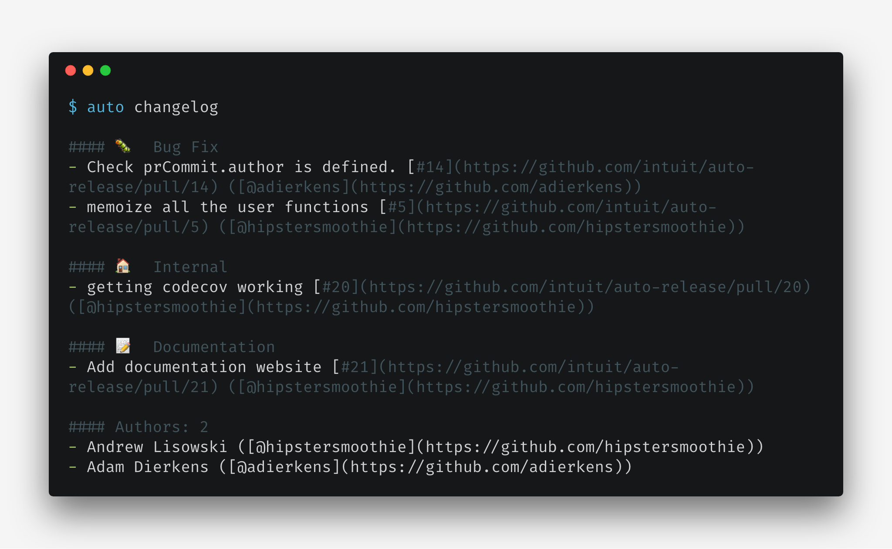
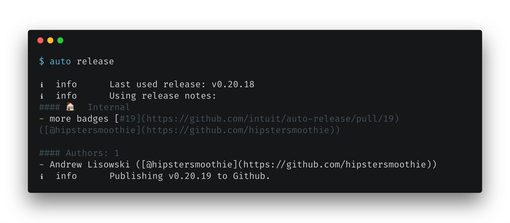
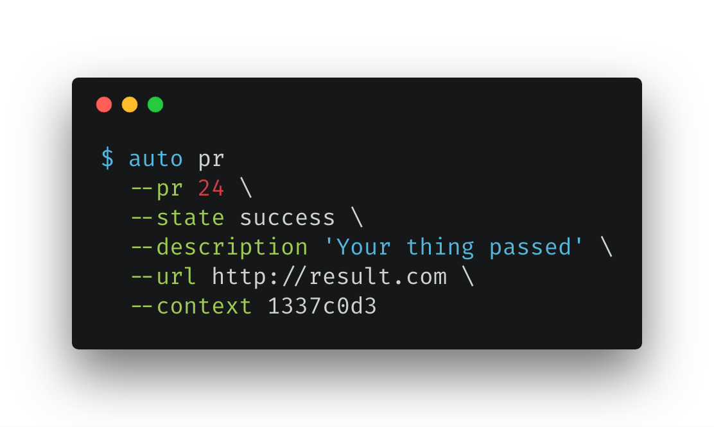

::: hero is-primary is-purple is-bold is-medium has-text-centered

# auto release

## CLI tools to help facilitate semantic versioning based on GitHub PR labels

:::

## Adding automated releases shouldn't be hard or require changing your workflow /.no-link .has-text-purple .has-text-centered\

`auto` makes automating releases for your open source project as simple as labels to pull requests. Releasing often means being confident in your releases. /.has-text-centered\

||| row has-text-centered wide

::: box

### Release Labels

Managing releases has never been easier. Just add a label!
:::

::: box

### Beautiful Changelogs

Link to PRs and Jira stories, include authors, monorepo aware, customizable
:::

::: box

### PR Interaction

Set statuses, check labels and comment on pull requests
:::

|||

||| row has-text-centered wide

::: box

### Atomic Functions

`auto` functions do 1 thing and they do it well. Easily use them to fit any build process
:::

::: box

### No Strict Commits

Other tools require you to change how any contributor commits to you project. With `auto` leave that baggage behind!
:::

::: box

### Fast Workflow

Since all you need to worry about are labels you can work at an incredibly fast pace! This speed to commit also helps with new contributors
:::

|||

::: hero is-info is-yellow is-small has-text-centered
Release Tools
:::

::::: hero is-small
:::: div columns
::: div column feature

# `auto version`

Get the semantic version bump using merged PRs

:::
::: div column

:::
::::
:::::

:::::: hero is-light is-small
::::: div columns
::: div column is-three-fifths

:::
:::: div column feature

# `auto changelog`

Prepend release notes to `CHANGELOG.md`.

::: div content list

- link PRs and Jira stories
- attach effected packages in monorepo
- list authors
- customizable sections

:::

::::
:::::
::::::

::::: hero is-small
:::: div columns
::: div column feature

# `auto release`

Auto-generate a github release.

:::
::: div column is-three-fifths

:::
::::
:::::

::::: hero is-light is-small no-margin
:::: div columns
::: div column

:::
::: div column feature

# `auto shipit`

Do all of the above in one simple command!
:::
::::
:::::

::: hero is-red is-link is-small has-text-centered
Pull Request Tools
:::

:::::: hero is-small
::::: div columns
::: div column

:::
:::: div column feature

# `auto pr`

Set the status on a PR commit

::::
:::::
::::::

::::: hero is-small is-light no-margin
:::: div columns
::: div column feature

# `auto comment`

Comment on a pull request with a markdown message.

:::
::: div column

:::
::::
:::::

:::: hero is-link is-purple is-small has-text-centered

# Win back your time and be confident in releasing! /.no-link .title .is-4 .has-text-centered\

::: button is-large is-link is-bold is-inverted is-outlined
[Get Started :tada:](pages/GettingStarted.md)
:::

::::
