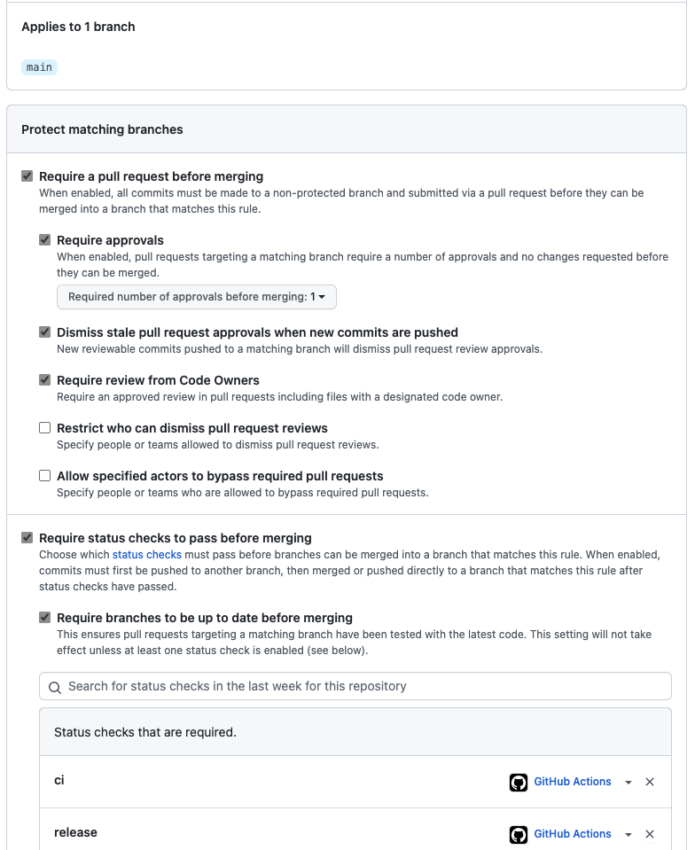
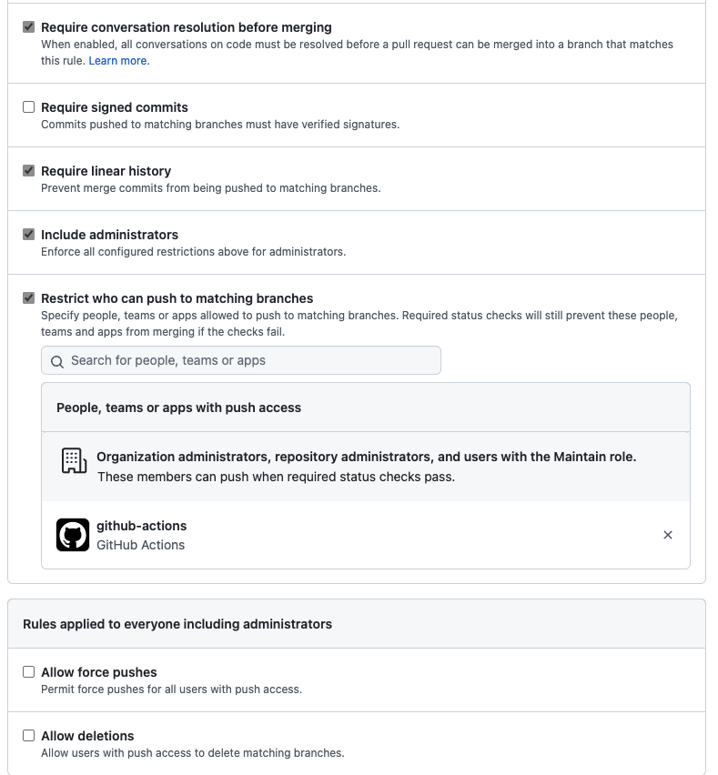

# Protected-Branch Plugin

Handle Github branch protections and avoid run auto with an admin token

## Prerequisites

This plugin still needs `Personal Access token` (PAT), but only with for a standard user with `write` permission on your repository.

That's means no need to have an Administration user.

That's also means that you are able to enforce all branches protection requirements for Administrators of your Organization.

When enforcing code owners, This user/ or a team must be designated as Owner/Co-Owner of released files.

## Installation

This plugin is not included with the `auto` CLI installed via NPM. To install:

```bash
npm i --save-dev @auto-it/protected-branch
# or
yarn add -D @auto-it/protected-branch
```

## Usage

No config example :

```json
{
  "plugins": [
    "protected-branch"
    // other plugins
  ]
}
```

Fully configured example :

```json
{
   "plugins": [
      [
         "protected-branch",
         {
            "reviewerToken": "redacted", // Probably better idea to set it in `PROTECTED_BRANCH_REVIEWER_TOKEN` environment variable
            "releaseTemporaryBranchPrefix": "protected-release-",
            "requiredStatusChecks": ["check-1", "check-2"]
         }
      ]
      // other plugins
   ]
}
```

## Configuration

## How to handle branch protection

The plugin intent to handled branches protections, without the need to use an administrators privileges or/and don't want to use administrator token in our workflow.

An example usage in a repository where we want to have the following protected branch configuration :




1. Create a bot account in this org (`auto-release-bot@org.com`)
2. Create a PAT with this bot user and give a `repo` permissions
3. On the repository, create a github actions secrets with the previously created PAT
4. On the repository, add `write` access to the bot account
5. When using CodeOwners, on the repository, for each released asset, let the bot account be owner and/or co-owners of each asset

   ```
   # Automatically released files must be also owned by our automation @bots team
   package.json    @org/owner-team auto-release-bot@org.com
   CHANGELOG.md    @prg/owner-team auto-release-bot@org.com
   ```

6. Configure this plugin correctly (see [Configuration](#configuration))
7. On the repository, be sure add `PROTECTED_BRANCH_REVIEWER_TOKEN` environment variable, and included the relevant permissions

   ```yaml
   permissions:
    # Needed to create PR statuses/checks
    checks: write
    statuses: write
    # Needed to push git tags, release
    contents: write
   ...
    # On auto shipit job step
    - name: Release
      env:
        PROTECTED_BRANCH_REVIEWER_TOKEN: ${{ secrets.<<YOUR-GITHUB-ACTIONS-SECRET-NAME>> }}
      run: yarn shipit
   ```

8. Ship it !

## Limitations

This plugin is not yet ready to :

- Handle more than 1 review requirement
- Dynamically list required status checks on target protected branch
